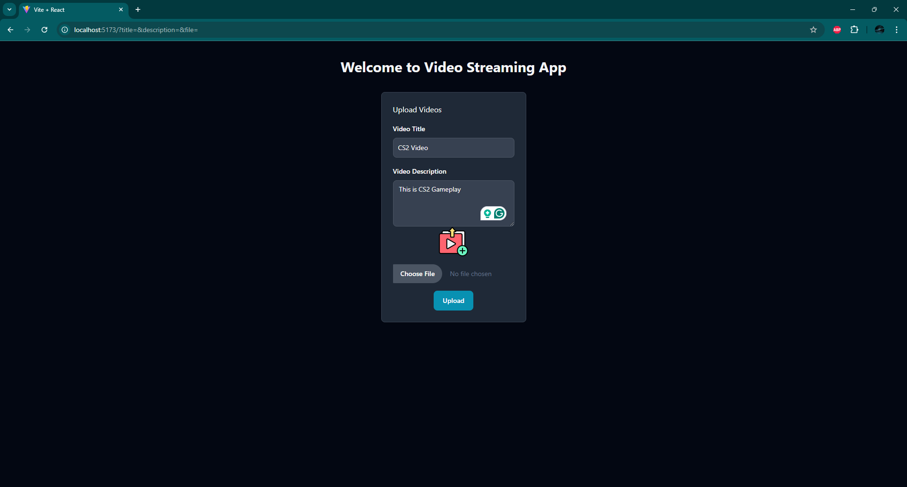
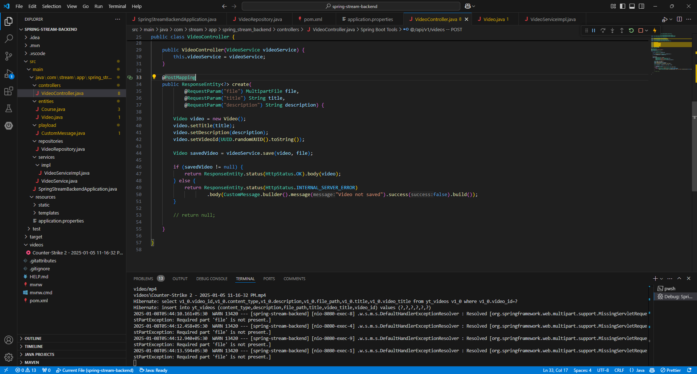
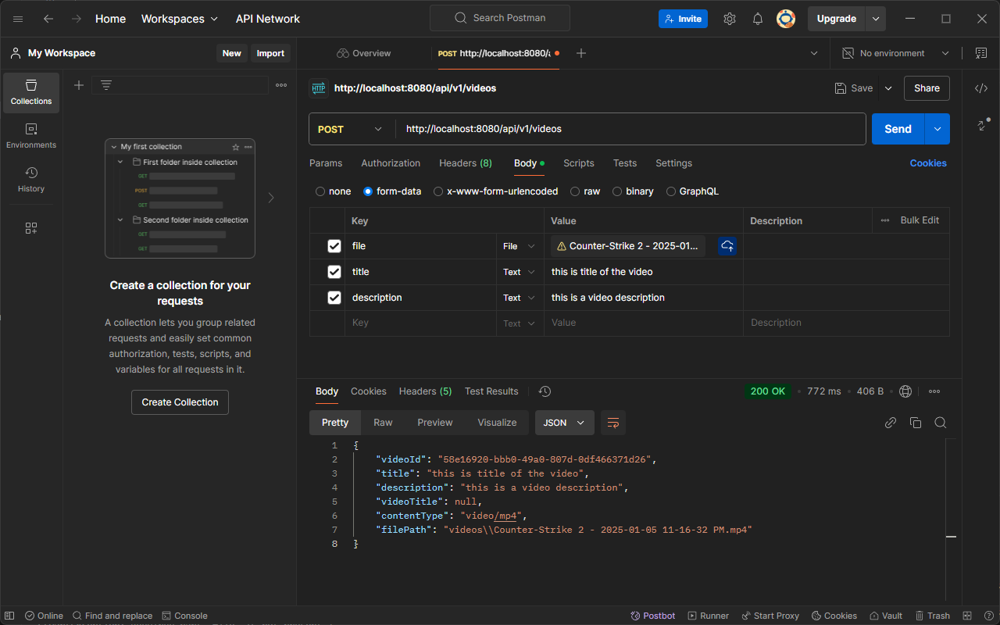

# Web Video Streaming (SpringBoot + Vite)

It's a simple application (frontend and backend) for streaming / uploading of a video.

## Image

    
    

## Technologies

- SpringBoot
- Vite
- Axios
- MySQL

## How to run

1. Clone the repository
2. Run the backend
3. Run the frontend

### Run the backend

1. Open the backend folder
2. Create a database in MySQL
3. Change the `application.properties` file with your database (url, username, password) configuration
4. Run the command `./mvnw spring-boot:run` or use your favorite IDE to run the project

### Run the frontend

1. Open the frontend folder
2. Run the command `npm install`
3. Run the command `npm run dev`

## How to use

1. Access the application
2. Fill Video Title and Description
3. Choose a video file
4. Click on the "Upload" button

### Note: The Video File Limit is 1000MB, To change this limit, go to the `application.properties` file and change the `spring.servlet.multipart.max-file-size` property.
